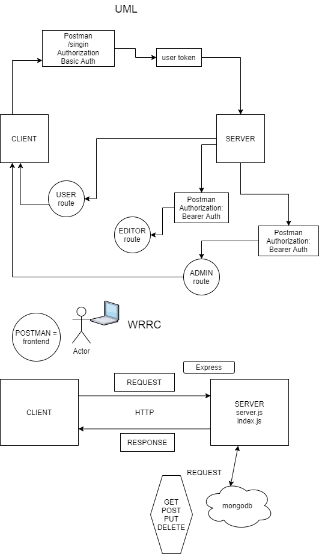

# LAB - Class 08

## Project: Auth-Api

### Author: Stacy Burris

### Links and Resources

+ [Heroku](https://stacyburris-auth-api.herokuapp.com/)
+ [GitHub](https://github.com/stacyburris/auth-api)
+ [ci/cd](https://github.com/stacyburris/auth-api/actions)
+ [PullRequest](https://github.com/stacyburris/auth-api/pull/3)

### Setup

+ `npm i` with all dependencies from package.json

`.env` requirements (were applicable)

+ `Port`=3000
+ `MONGODB_URI`=mongodb://localhost:27017/merge
+ `SECRET`=<secret>

### How to initialize/run your application (where applicable)

+ nodemon

### Test

  + npm test

### UML/WRRC

